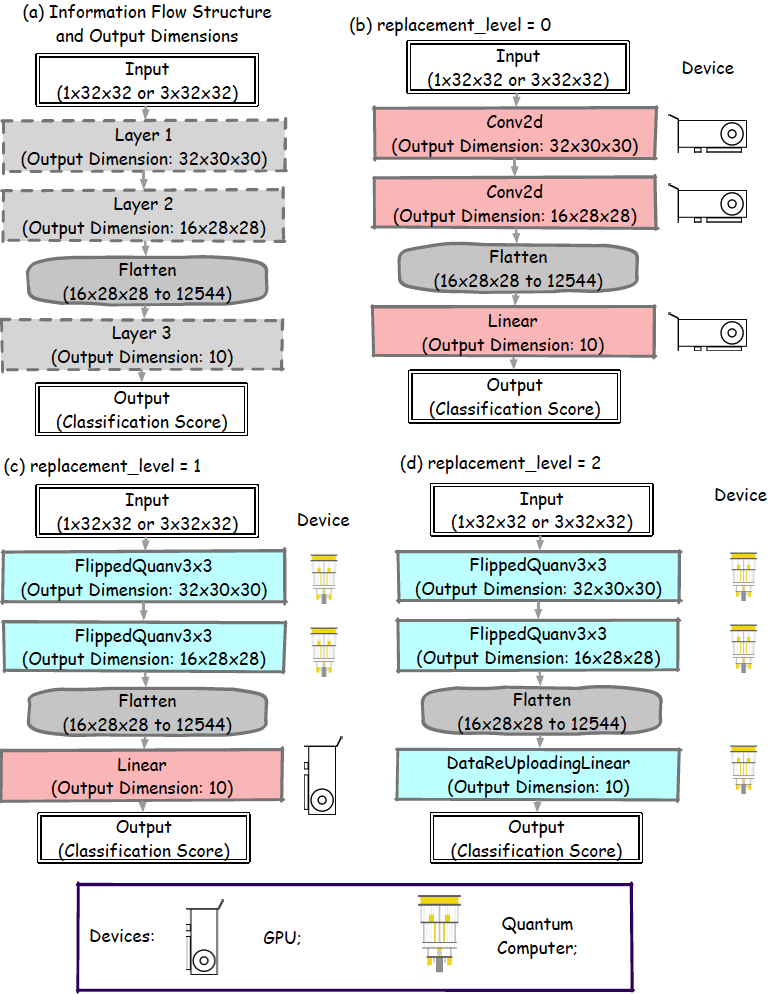

# Let-The-Quantum-Creep-In

This repository contains the code for the paper [Let the Quantum Creep In: Designing Quantum Neural Network Models by Gradually Swapping Out Classical Components](https://arxiv.org/abs/2409.17583) by _Peiyong Wang, Casey R. Myers, Lloyd C. L. Hollenberg and Udaya Parampalli_.

Artificial Intelligence (AI), with its multiplier effect and wide applications in multiple areas, could potentially be an important application of quantum computing. Since modern AI systems are often built on neural networks, the design of quantum neural networks becomes a key challenge in integrating quantum computing into AI. To provide a more fine-grained characterisation of the impact of quantum components on the performance of neural networks, we propose a framework where classical neural network layers are gradually replaced by quantum layers that have the same type of input and output while keeping the flow of information between layers unchanged, different from most current research in quantum neural network, which favours an end-to-end quantum model. We start with a simple three-layer classical neural network without any normalisation layers or activation functions, and gradually change the classical layers to the corresponding quantum versions. We conduct numerical experiments on image classification datasets such as the MNIST, FashionMNIST and CIFAR-10 datasets to demonstrate the change of performance brought by the systematic introduction of quantum components. Through this framework, our research sheds new light on the design of future quantum neural network models where it could be more favourable to search for methods and frameworks that harness the advantages from both the classical and quantum worlds.

Figure 1: Overview of the framework proposed in this paper. (a) the information flow structure and the required dimensions of the input and output of each vacancy for candidate neural network layers. Double-lined boxes are the input and output of the neural network; Dash-lined boxes are layer vacancies for candidate neural network layers. Alongside the block of layers are the devices where the layer operation will mainly be executed on. The information passed between layers and the flatten operation are classical, while the candidate neural network layers could be either classical or (simulated) quantum. (b) The hybrid neural network, `HybridNet`, when `replacement_level = 0`. In this case all vacancies are filled with classical neural network layers (`Conv2d` and `Linear`). All these layers are executed on a GPU with classical neural network libraries. (c) `HybridNet`, when `replacement_level = 1`. In this case, the classical convolution layers `Conv2d` are replaced with its quantum counterpart, `FlippedQuanv3x3`, while the classical `Linear` layer left unchanged. The two quantum layers could be executed either via GPU simulation or on an actual quantum device. In this paper, they are simulated on a GPU since the current accessibility of quantum processors prohibits us from executing a very large number of circuits. (d) `HybridNet`, when `replacement_level = 2`. In this case, all the classical layers in (b) are replaced with their quantum counterpart, i.e.  `Conv2d`$\rightarrow$ `FlippedQuanv3x3` and `Linear`$\rightarrow$`DataReUploadingLinear`. All quantum layers are simulated on a GPU when training and testing the neural network model.
